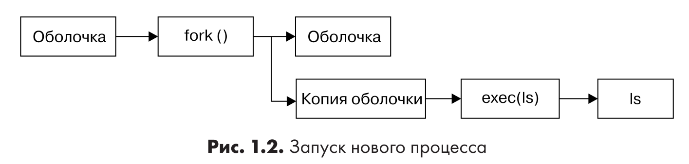
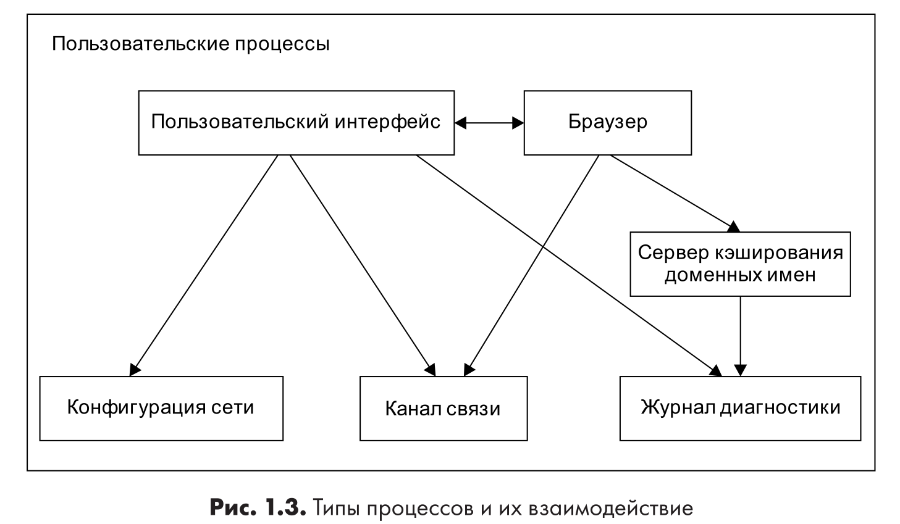

# Ядро

Почти все, что делает ядро, связано с оперативной памятью. Одной из задач ядра является разделение на множество областей, и оно должно постоянно остлеживать информацию об их состоянии.
Каждый процесс получает некоторую часть памяти, и ядро должно обеспечивать ее необходимое кол-во.

*Ядро отвечает за управление задачами в четырех основных областях*:
- *Процессы.* Ядро определяет, каким процессам разрешено использовать процессор.
- *Память.* Ядро должно отслеживать распределение памяти: сколько в данный момент выделено конкретному процессу, сколько можно разделить между другими процессами и сколько свободно.
- *Драйверы устройств.* Ядро действует, как интерфейс между оборудованием (например, диском) и процессами. Обычно оно управляет подключенным оборудованием.
- *Системные вызовы и поддержка.* Процессы обычно используют системные вызовы для связи с ядром.

## Управление процессами

Управление процессами описывает запуск, приостановку, возобновление, планирование и завершение процессов.

В любой современной ОС многие процессы выполняются параллельно. Например, у вас могут быть открыты веб-браузер и электронная таблица одновременно. Однако, все не так, как кажется: процессы, стоящие за этими приложениями, обычно не выполняются в одно и тоже время.

Рассмотрим систему с одноядерным процессором. Многие процессы могут задействовать процессор, но только один из них файтически использует процессор в любой момент времени. На практике процесс работает с процессором в течение небольшой доли секунды и делает паузу, затем другой процесс занимает процессор в течение еще одной доли секунды, потом в дело вступает еще один процесс и т.д. Акт передачи одним процессом управления процессором другому процессу называется *переключением контекста*.

Каждый отрезок времени, называемый *квантом времени*, позволяет процессу выполнить значительные вычисления (процесс завершает свою задачу в течение одного кванта). Однако из-за того, что кванты очень малы, пользователи их не воспринимают, и возникает ощущение, что система выполняет несколько процессов одновременно (режим многозадачности).

*Ядро отвечает за переключение контекста*. Рассмотрим ситуацию, в которой процесс работает в пользовательском режиме, но его временной квант истек. Вот что происходит:
1. Процессор (файтическое оборудование) прерывает текущий процесс на основе внутреннего таймера, переключается в режим ядра и передает управление обратно ядру.
2. Ядро записывает текущие состояние процессора и памяти, что необходимо для возобновления только что прерванного процесса.
3. Ядро выполняет любые задачи, которые могли возникнуть в течение предыдущего временного кванта (например, сбор данных из ввода-вывода).
4. Теперь ядро готово к запуску другого процесса. Оно анализирует список процессов, готовых к запуску, и выбирает один из них.
5. Ядро подготавливает память для нового процесса, а затем готовит к нему процессор.
6. Ядро сообщяет процессору длительность временного кванта для нового процесса.
7. Ядро переключает процессор в пользовательский режим и передает управление процессором процессу.

Переключение контекста позволяет понять, когда именно запускается ядрою. Суть заключается в том, что ядро запускается между временными квантами процесса во время переключения контекста.

В случае многопроцессорной системы, как и в большинстве современных машин, все немного сложнее, потому что ядро не перестает управлять текущим процессором, чтобы позволить процессу работать на другом процессоре, и одновременно могут выполняться несколько процессов. Но чтобы максимально задействовать все доступные процессору, ядро в любом случае выполняет необходимые шаги.

## Управление памятью

Ядро управляет  памятью во время переключения конткста. Должны выполняться слудующие условия:
- Ядро должно иметь в памяти выделенную область, к которой пользовательские процессы не могут получить доступ.
- Каждому пользовательскому процессу необходима собственная область памяти.
- Один пользовательский процесс не может получить доступ к области памяти, выделенной другому процессу.
- Пользовательские процессы могут совместно работать с памятью.
- Часть памяти пользовательских процессов может быть доступна только для чтения.
- Система может использовать больше памяти, чем ее существует физически, задействуя дисковое пространство в качестве вспомогательного механизма.

Ядро не одно выполняет работу. Современные процессоры включают в себя блок управления памятью (memory management unit, MMU), который обеспечивает схему доступа к памяти, называемую *виртуальной памятью*. При использовании виртуальной памяти процесс не получает прямого доступа к памяти через ее физ. местоположение в комп. системе. Вместо этого ядро настраивает каждый процесс, чтобы он действовал так, будто ему доступна вся система. Когда процесс обращается к части своей памяти, MMU перехватывает обращение и с помощью таблицы соответствий преобразует адрес памяти с точки зрания процесса в фактическое физ. местоположение памяти в системе.
Ядро по-прежнему должно инициализировать, постоянно поддерживать и изменять табицу соответствий адресов памяти. Например, во время переключения контекста, ядро должно заменить таблицу соответствий исходного процесса на таблицу последующего процесса.

## Управление драйверами устройств

Устройство обычно доступно только в kernel mode, посколько неправильный доступ может привести к сбою системы (например user process запрашивающий отключение питания).
Значительная проблема зключается в том, что различные устройства редко имеют один и тот же интерфейс программирования, даже если устройства выполняют одну и ту же задачи (например, две сетевые карты). Поэтому драйверы устройств являются частью ядра, и они стремятся представить единый интерфейс для user processes, чтобы упростить работу разработчика ПО.

## Системные вызовы и поддрежка

Системные вызовы (sysem calls, syscalls) выполняют задачи, которые сам user process выполнить не может. Например, все действия по открытию, чтению и записи файлов связаны с системными вызовами.

Два системных вызова, fork() и exec(), важны для понимания того, как запускаются процессы.
- **fork()** - когда процесс вызывает fork(), ядро создают почти идентичную копию процесса.
- **exec()** - когда процесс вызывает exec(program), ядро загружает и запускает программу program, заменяя текущий процесс.

Все новые user processes в Linux, за исключением _init_, запускаются в результате вызова fork(), и в большинстве случаев exec() применяется для запуска новой программы вместо запуска копии существующего процесса. 

Пример:
При выполнении команды ls, оболочка внутри окна ввода вызывает fork() для создания копии оболочки, а затем новая копия оболочки вызывает exec(ls) для запуска команды ls.

Ядро поддерживает пользховательские процессы с функциями, отличным от традиционных системных вызовов, наиболее распространенными из которых являются всевдоустройства. Они выглядят как устройства для пользовательский процессов, но реализуются исключительно в ПО. Это значит, что технически их не должно быть в ядре, но обычно они там присутствуют из практической необходимости. Например, устройство генератора случайных чисел ядра (/dev/random) было бы трудно безопасно реализовать с помощью user process.

## Пользовательское пространство

Оперативная память, выделяемая ядром для user processes - user space (пользовательское пространство). Поскольку процесс - это просто состояние (или образ) в памяти, user space соответствует и всем запущенным процессам в памяти.
_Иногда вместо userspace используют термин userland._

На скриншоте представлена приблизительная элементарная структура уровней обслуживания для различных типов системных компонентов, которые представляют пользовательские процессы.

## Пользователи

Ядро Linux поддерживает концепцию пользователя Unix. _Пользователь (user)_ - сущность, которая может запускать процессы и владеть файлами.
Например, в системе может быть пользователь kal. Однако ядро не управляет именами пользователей, оно лишь идентифицирует пользователей с помощью простых числовых идентификаторов пользователей (user ID, UID).

Пользователи существуют в основном для поддержки прав и границ в системе. Каждый процесс в user space имеете владельца (owner) и выполняется от его имени. Пользователь не может вмешиваться в процессы других пользователей. 

Linux обычно имеет несколько пользователей в дополнение к тем, которые соответствуют реальным пользователям.

_Суперпользователь (superuser, root)_ - исключение из рассмотренных ранее правил, поскольку он может завершить и изменить процессы других пользователей и получить доступ к любому файлу. 
Но как бы не был силен суперпользователь, он по-прежнему задействует user mode ОС, а не kernel mode.

_Группы (groups)_ - набор пользователей. Основная цель групп - позволить пользователю получать доступ к файлам совместно с другими членами группы.

